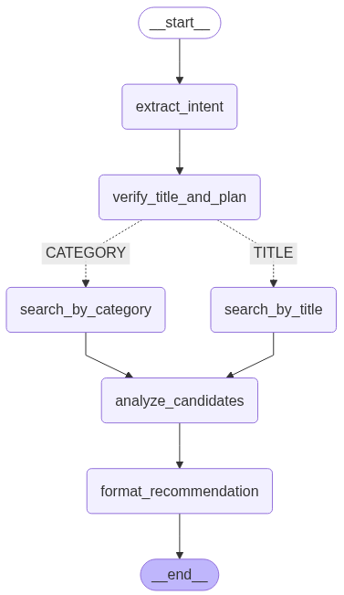

# Agentic Movie Recommender Systems


An intelligent movie recommender built with LangGraph that understands nuanced, natural language requests to provide tailored movie suggestions.

---

## 📖 Overview

The goal of this project is to address the challenge of finding relevant movie recommendations from natural language queries. The system's core is an agentic workflow that leverages a Large Language Model (LLM) to understand complex user requests (e.g., "an underrated sci-fi movie with a great plot"), dynamically decide on a search strategy, and formulate a ranked, justified list of suggestions.

## ✨ Key Features

- **Agentic Workflow:** Built using **LangGraph** to create a multi-step, stateful reasoning process from query parsing to final, engaging output.
- **Natural Language Understanding:** Powered by the **Qwen3-4B LLM** to extract key entities like titles, genres, and semantic keywords (e.g., "dystopia," "heist," "zombie") from user input.
- **Dual-Pathway Recommendation Engine:** The agent dynamically chooses its strategy:
  - **Title-based Search:** Uses a weighted similarity score combining both genres and keywords for highly specific recommendations.
  - **Category-based Search:** Flexibly finds movies matching either genres or keywords if no title is mentioned.
- **Resilient & Data-Grounded:** Includes robust error handling and adaptive JSON parsing to manage and self-correct LLM output inconsistencies, ensuring reliable performance on the TMDB dataset.

## 🎯 Workflow Diagram


## 🛠️ Tech Stack

- **Core Framework:** LangGraph
- **LLM:** Qwen/Qwen3-4B via Hugging Face Transformers
- **Data Manipulation:** Pandas
- **Orchestration:** Python 3.9+
- **Hardware Acceleration:** PyTorch, bitsandbytes, accelerate

## ⚙️ Setup and Installation

1.  **Clone the repository:**
    ```bash
    git clone https://github.com/qrcodeTH/-Agentic-Movie-Recommender-Systems.git
    cd -Agentic-Movie-Recommender-Systems
    ```

2.  **Create and activate a virtual environment (recommended):**
    ```bash
    python -m venv venv
    source venv/bin/activate  # On Windows, use `venv\Scripts\activate`
    ```

3.  **Install dependencies:**
    ```bash
    pip install -r requirements.txt
    ```

4.  **Download Dataset:**
    - This project uses the [TMDB 930k movies dataset](https://www.kaggle.com/datasets/asaniczka/tmdb-movies-dataset-2023-930k-movies).
    - Download the `TMDB_movie_dataset_v11.csv` file.
    - Place it in the correct path as specified in `config.py` (e.g., `/kaggle/input/tmdb-movies-dataset-2023-930k-movies/TMDB_movie_dataset_v11.csv`). You may need to create this directory structure or update the path in `config.py`.

## 🚀 How to Run

To run the agent, simply execute the main script:

```bash
python main.py
```

You can change the test query by editing the `user_question` variable inside the `if __name__ == "__main__":` block in `main.py`.

## 📂 Project Structure

```
Agentic Movie Recommender Systems/
├── assets/
│   └── workflow_diagram.png   <-- รูปของคุณ
├── main.py             # Main script to build the graph and run the agent
├── agent_nodes.py      # Contains all the node functions (logic for each step)
├── config.py           # Handles model loading, data loading, and constants
├── requirements.txt    # Project dependencies
└── README.md           # This file
```

## 📄 License

This project is licensed under the MIT License. See the [LICENSE](LICENSE) file for details.
